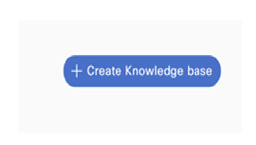
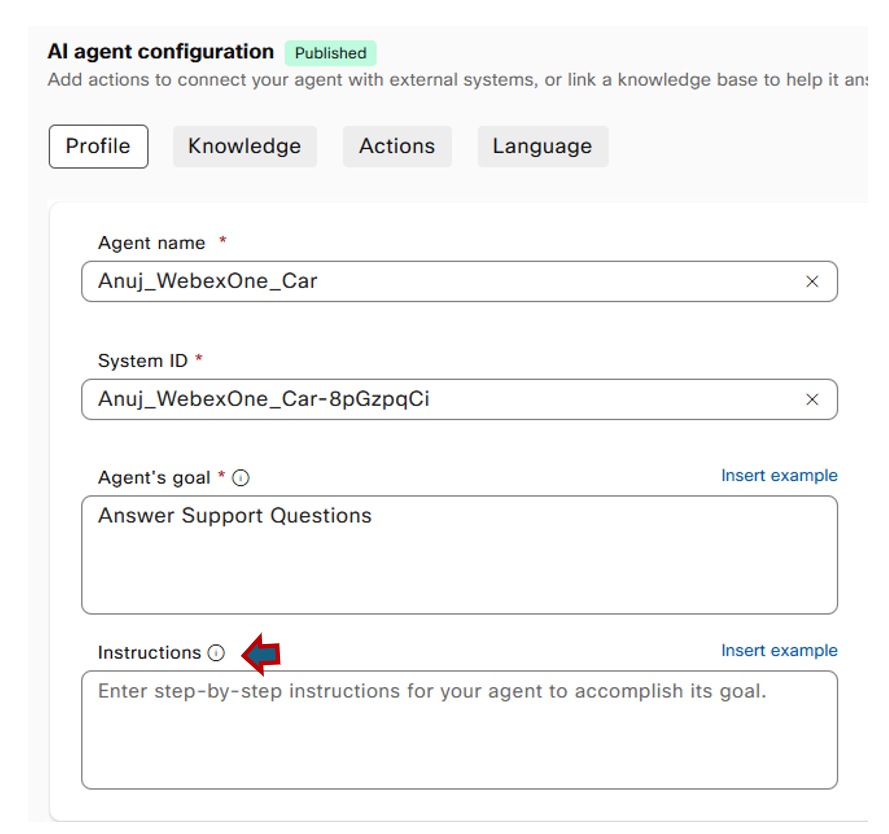

# Excercise 1 - Webex AI Agent 

Please use the following credentials to connect to Control Hub and configure Webex Contact Center:

| <!-- -->         | <!-- -->         |
| ---------------- | ---------------- |
| `Control Hub URL`            | <a href="https://admin.webex.com" target="_blank">https://admin.webex.com</a> |
| `Username`       | wxccemealabs+admin**ID**@gmail.com  _(where **ID** is your assigned pod number; this ID will be provided by your proctor)_ |
| `Password`       | ciscoliveAMER25! |

**AI Agents Overview**

Cisco Webex AI Agents provide automated assistance to customers before they interact with human agents across voice or digital channels. These agents leverage language understanding and contextual awareness within conversations. Residing within the CPaaS ecosystem, administrators can utilize the Webex AI Agent Studio platform to design, create, manage, and deploy these agents to meet customer service and support needs.

Two primary types of AI Agents are currently available:

- **Autonomous AI Agents**: These operate independently, making decisions and performing tasks without direct human intervention where the key capabilities include:
    - Answering Questions: Accessing and utilizing a knowledge repository to provide informative and accurate responses to user queries.
    - Performing Actions: Automating time-consuming or repetitive tasks by making choices based on information and predefined rules.

- **Scripted AI Agents**: These deliver precise and timely responses to customer inquiries in real-time. They execute tasks based on specific customer requests or inputs.

Integrating these agents into customer business ecosystems can significantly enhance customer experience by delivering personalized, real-time conversational interactions. 
Furthermore, AI Agents can be easily scaled to accommodate high volumes of customer interactions without the need for additional human agents, leading to improved customer satisfaction and reduced operational costs.

**Prerequisites**

To ensure the WxCC Tenant can be enabled for this feature and that the feature can be used effectively, the following requirements must be adhered to:
- Webex Contact Center tenant with Flex 3 subscription and A-FLEX-AI-AGT SKU
- Webex Connect capability on the tenant.

**Objective**

In this lab, participants will learn to:
- Set up Autonomous AI Agents from scratch.
- Configure these agents to generate and present answers to queries by accessing and utilizing a knowledge repository.
- Create and manage the underlying knowledge base

**Steps**

- Since the task is to create autonomous AI agents that are capable of answering questions from a knowledge base, the first step would be to build that knowledge base.

- Sign in to Control Hub using the URL https://admin.webex.com.

- Use the credentials highlighted in the table above.

- In Quick Links on the right pane of the Contact Center suite section, click Webex AI Agent to access the studio.

      { width="600" }

- On the Dashboard, click the Knowledge icon on the left navigation pane to go to the Knowledge Bases page.

      { width="300" }

- Click + Create Knowledge Base on the upper right corner.

      { width="300" }

- On the Create Knowledge Base page, enter the knowledge base name as WebexOne_YourName.

- Click Create. The system creates a knowledge base with the specified name.

      { width="500" }
  
- For this lab, let's add FAQ content specific to Cisco Support service for collaboration. Download the PDF from the link below.
 
  [Cisco Support Services for Collaboration FAQ](https://github.com/anujbhatiaminer82/Test2/blob/19c17379ca564d164bde1bf583fcf0a291d51e72/support-services-for-collaboration-faq.pdf)
  

- Drag and drop the PDF file to the knowledge base. Alternatively, click Add File to add a file.

      { width="500" }

!!! Note
        The system supports the following file formats: PDF, DOC, DOCX, DOCX, TXT, XLSX, XLS, and CSV. The size of each file must not exceed 2 MB.

- After adding the file, bring up the browser developer tool (Shortcut: Press F12 Key). 

- Once the developer tool is up, ensure that it's on the "Console" tab.

- Clear the console logs by selecting the "Clear Console" button and click Process File to process them. 

      { width="500" }

      { width="500" }

- When done, the system lists the files under the Files tab.

      { width="500" }

- The browser logs will show a 'success' status, along with the 'kb_id', 'kb_category_id', and 'kb_documented_id'. 

      { width="500" }

!!! Note
       This is essential information for Cisco TAC team to analyze and troubleshoot any issues that may have caused the upload to fail. 
  
- Navigate to the Information tab to view and track the details of the files you uploaded and the documents you created , KB ID is also present on the top left corner. 

      { width="500" }

- Now, it's time to create the AI bot itself.

- On the Dashboard, click +Create agent.

      { width="500" }

- On the Create an AI Agent screen, click Start from scratch tile followed by Next button (bottom of the screen)

      { width="300" }

- In the What type of agent are you building section, click Autonomous.

      { width="300" }

- On the 'Add the essential details' specify the following details:
    - Agent name: Enter the name of the AI agent.
    - System ID: A system-generated unique identifier. This field is editable.
    - AI engine: Select the required AI engine from the drop-down list  (default its Webex AI Pro 1.0 ).
    - Agent's goal: Provide a brief description of the AI agent's goal which in this case is to answer queries hence the prompt "Answer Support Questions". 
    - Click Create button at the bottom of the screen.

      { width="500" }
  
- The autonomous AI agent for answering questions is successfully created and is now available on the Dashboard.

      { width="600" }

- The Profile tab on the Agent Configuration page, after creation, allows you to change the agent's image, the AI engine it uses, its goal, and the welcome message displayed when the bot is initiated.  

- These are the fields that control these aspects:
    - URL for agent profile image: The default URL from which the system fetches the AI agent's logo or image.
    - AI engine: The chosen AI engine is displayed.
      !!! Note
              By default, Webex AI Agent Pro 1.0 (with GPT 4.0) is the only available AI engine.
    - Welcome message: The default welcome message that the AI agent uses to start the interaction. 

- Lets map the Agent with the Knowledge base that was created.
  
- Navigate to Configurations > Knowledge tab and choose the required knowledge base from the drop-down list.

      { width="500" }

- Click Save changes and publish to make the AI agent live.

      { width="500" }

- Now it's time to test the bot. One way to check if the bot is constructing and answering queries correctly is to use the Preview option.

      { width="500" }

- Click the "Preview" button , a chat window appears in the bottom right corner of the pane where questions can be entered.

      { width="300" }

- To test in this example, we pose the question "What warranty comes with the vehicle?"
  
- The response provided was accurate and consistent with the knowledge base created for this bot

      { width="500" }

- The instruction section of the bot helps refine it to be more sophisticated and behave in the manner that the business dictates.

      { width="500" }

- In this example, let's work on these three areas of the bot with the following instructions:

    - Tone and Demeanor: Be polite, as the client is important.
    - Role Definition: Answer the question in no more than 50 words.
    - Response Guidelines: Thank the user for their business and say goodbye.

- Add these guidelines to the Instructions section, save, and publish the changes.

      { width="500" }

- To test, pose the same question: "What warranty comes with the vehicle?"

- As the Role Definition dictated answering within 50 words, you will see the answer within that limit.

      { width="500" }

- You can now view the details of these sessions and the history of configuration changes performed on the AI agent through the Sessions section. 

- This information is useful for auditing, analyzing, and improving the AI agent.

- From the left navigation pane, click Sessions.

      { width="200" }

- The Sessions page appears, where each session is displayed as a record containing all the messages of the session, along with the following fields:

      { width="500" }

    - Channels: The channel where the interaction took place.
    - Session ID: The unique room ID or session ID for a conversation.
    - Room Metadata: Additional information about the room.

- Click on an individual row in the sessions table for a detailed view of that session.

- The system displays the following session details:

      { width="500" }
  
    - The left panel displays details about the transactions.
    - The right panel displays details about slot filling and fulfillment related to all actions. This is applicable to actionable actions for the bot.

- Finally, to view the details of configuration changes performed on the AI agent, you can use the History tab in the navigation pane.

      { width="200" }

- The History pane provides information about the version history and change logs.

- Please review this information at your convenience.

# Result
- Congratulations on finishing the lab! Now, let's dive into the next exercise to enhance this agent so it can perform actions.