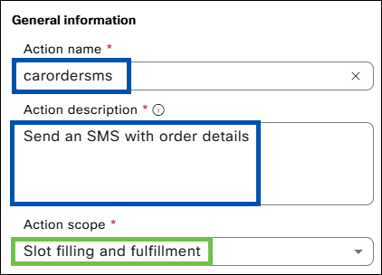
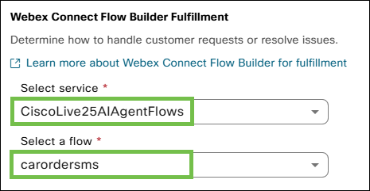
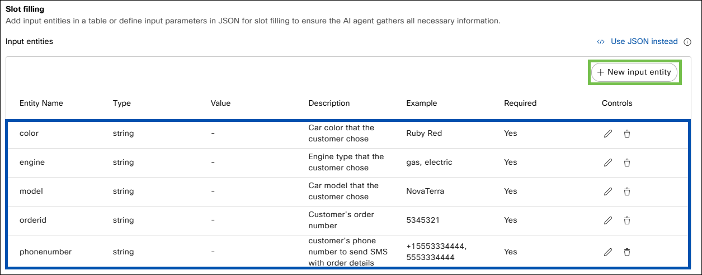

# Task 2 - Autonomous Webex AI Agent Actions


Please use the following credentials to connect to Control Hub and configure Webex Contact Center:

| <!-- -->         | <!-- -->         |
| ---------------- | ---------------- |
| `Control Hub URL`            | <a href="https://admin.webex.com" target="_blank">https://admin.webex.com</a> |
| `Username`       | wxccemealabs+admin**ID**@gmail.com  _(where **ID** is your assigned pod number; this ID will be provided by your proctor)_ |
| `Password`       | ciscoliveAMER25! |

**Objective**

In this lab, audience will learn to explore and set up Autonomous Webex AI Agent actions using Webex Connect flows. They will also learn how to configure these flows to interact with external APIs, allowing the AI Agent to handle data and fulfill requests by connecting to other services.

## **Section 1 : Create a Webex Connect Flow for Car Order**

- Action fulfillment for the agent is always handled via Webex Connect flows. 

- Lets begin by creating a Webex Connect flow, which can later be selected to a specific Webex AI action.

- Navigate to the Webex Connect portal through the **'Quick Links'** section in the Webex Contact Center area of Control Hub.

{ width="300" }

- Create a new service by clicking **'Create New Service'** and providing a name (i.e. Webexone_carorderservice_Name_).

{ width=800" }

- Navigate to **'Flows'** section and click **'Create Flow'**.

{ width="800" }
  
- Proivde a **'Flow Name'** (i.e. _carcreateorder_name_), ensure that **'Start from Scrach'** is selected, and click **'Create'**. 

!!! info
	This flow will interact with external database using API to create a car order.

{ width="500" }

- In the next menu, select **'AI Agent'** under **'Integrations'**.

{ width="300" }

- **'Configure AI Agent Event'** is displayed. Under **'Provide sample Json'** provide the variables that will be passed from the Webex AI Agent. For a new car order, use the following:
```ios
{
"model": "",
"color": "",
"engine": "",
"customer": ""
}
```
- Click **'Parse'** and **'Save'**.

{ width="500" }

- Drag the **'HTTP Request'** node from the left-hand side menu, place it next to the **'AI Agent'** node, and connect them by clicking and holding the green dot on the **'AI Agent'** node and dragging it to the **'HTTP Request'** node.

{ width="600" }

- Double click on the **'HTTP Request'** node and fill the fields as follows:

| Field name                                | Value                                       |
| :---------------------------------------- | :------------------------------------------ |
| `Method`                                  | POST                                        |
| `Endpoint URL`                            | https://68085a3f942707d722ddf6a8.mockapi.io/api/cars                       |
| `Header`                           	    | Content-Type                                |
| `Value`                                   | application/json                            |
| `Output Variable Name` (click **'+Add Variable'**)    | orderid                                     |
| `Response Entity`                        | Body                                        |
| `Response Path`                           | $.orderid                                   |

For **'Body'** section use:
```ios
{
 "color": "$(n2.aiAgent.color)",
 "engine": "$(n2.aiAgent.engine)",
 "model": "$(n2.aiAgent.model)",
 "customer": "$(n2.aiAgent.customer)"
}
```

- Click **'Save'**.

{ width="600" }

- Configure **'HTTP Request'** node outcomes by dragging the orange, green, and red outcome dots to empty space on the canvas and selecting appropriate outcomes (e.g., **'onTimeout'** - Error, **'onSuccess'** - Success, **'onError'** - Error).

{ width="500" }
{ width="500" }
{ width="500" }

- Next, click **'Flow Settings'** (gear icon), navigate to **'Flow Outcomes'**, and expand **'Last Execution Status'** outcome.
- Click **'Add New'**, use 'orderid' under **'Key'** and '$(n3.orderid)' under **'Value'**.
- Click **'Save'**.

{ width="1000" }

- Make the flow live by clicking **'Make Live'** (top right corner) and then clicking  **'Make Live'** again in the next dialog box.

{ width="400" }


## **Section 1a - Configuring the Car Order Creation Action for the Webex AI Agent**

!!! tip
	If you manually created the car order action above, move directly to the [**Section 2 - Configuring car order status, modify and, delete actions for Webex AI Agent**](#section-2-configuring-the-car-order-status-modify-and-delete-actions-for-the-webex-ai-agent) section.

- Navigate back to the AI Agent Studio and to your Autonomous Webex AI Agent.
- Select **'Actions'** and click **'New Action'**.


{ width="600" }


- Provide an **'Action Name'** (use _carordercreate_).
- Provide the following **'Action description'**:
```ios
Submit a car order when the customer chooses a model and all other customization options.  
Provide orderid after a successful order.  
```
- Under **'Action scope'**, select **'Slot filling and fulfillment'**.

{ width="500" }

- Select the service you created in the previous task under **'Select service'** and the flow created above under **'Select a flow'**.
- (If **Section 1** was skipped, select prebuilt service _CiscoLive25AIAgentFlows_ under **'Select service'** and _carordercheck_ flow under **'Select a flow'**).

{ width="500" }

- Click **'New input entity'**.

{ width="1000" }

- Add four entities for the Webex AI Agent to pass to the Webex Connect flow with the following parameters:

| Entity name    | Entity type  | Entity description | Entity examples | Required |
| :------------- | :----------- | :----------------- | :-------------- | :--------|
| model        | String    | Car model that the customer chose | NovaTerra | Yes  |
| color        | String    | Car color that the customer chose | Ruby Red | Yes  |
| engine        | String    | Engine type that the customer chose | gas, electric | Yes  |
| customer        | String    | Customer's name | Jack, Nick | Yes  |

{ width="600" }
{ width="1000" }

- Click **'Add'**.

{ width="200" }


## **Section 2 - Configuring the Car Order Status, Modify, and Delete Actions for the Webex AI Agent**

!!! info
	To make the Autonomous Webex AI Agent more capable, additional bot actions are needed. The configuration process is very similar to the one completed above for order creation. For simplicity, Webex Connect flows for these next actions are already prebuilt and will not require manual configuration.


**Car order check action**

- In the AI Agent Studio, navigate to your Autonomous Webex AI Agent.
- Select **'Actions'** and click **'New Action'**.
- Provide **'Action Name'** (use _carordercheck_).
- Provide the follwoing **'Action description'**:
```ios
Check an existing car order and provide details about the order - model, color, engine type, and orderid.  
```
- Under **'Action scope'**, select **'Slot filling and fulfillment'**.

{ width="500" }

- Select the prebuilt service _CiscoLive25AIAgentFlows_ under **'Select service'** and the _carordercheck_ flow under **'Select a flow'**.

{ width="500" }

- Click **'New input entity'**.


| Entity name    | Entity type  | Entity description | Entity examples | Required |
| :------------- | :----------- | :----------------- | :-------------- | :--------|
| orderid        | String    | orderid provided by the customer | 5345321 | Yes  |

{ width="800" }

- Click **'Add'**.


**Car order modify action**

- In the AI Agent Studio, navigate to your Autonomous Webex AI Agent.
- Select **'Actions'** and click **'New Action'**.
- Provide **'Action Name'** (use _carordermodify_).
- Provide the following **'Action description'**:
```ios
Collect the orderid  and modify the order as per the customer's request. 
```
- Under **'Action scope'**, select **'Slot filling and fulfillment'**.

{ width="500" }

- Select the prebuilt service _CiscoLive25AIAgentFlows_ under **'Select service'** and the _carordermodify_ flow under **'Select a flow'**.

{ width="500" }

- Add five entities for the Webex AI Agent to pass to the Webex Connect flow.
- Click **'New input entity'**.


| Entity name    | Entity type  | Entity description | Entity examples | Required |
| :------------- | :----------- | :----------------- | :-------------- | :--------|
| orderid        | String    | Order Id of the existing order | 5345321 | Yes  |
| model        | String    | Car model that the customer chose | NovaTerra | No  |
| color        | String    | Car color that the customer chose | Ruby Red | No  |
| engine        | String    | Engine type that the customer chose | gas, electric | No  |
| customer        | String    | Customer's name | Jack, Nick | No  |

- Click **'Add'**.

{ width="1200" }


**Car order delete action**

- In the AI Agent Studio, navigate to your Autonomous Webex AI Agent.
- Select **'Actions'** and click **'New Action'**.
- Provide **'Action Name'** (use _carorderdelete_).
- Provide the follwoing **'Action description'**:
```ios
Delete the order when requested.
```
- Under **'Action scope'**, select **'Slot filling and fulfillment'**.

{ width="500" }

- Select the prebuilt service _CiscoLive25AIAgentFlows_ under **'Select service'** and the _carorderdelete_ flow under **'Select a flow'**.

{ width="500" }

- Click **'New input entity'**.


| Entity name    | Entity type  | Entity description | Entity examples | Required |
| :------------- | :----------- | :----------------- | :-------------- | :--------|
| orderid        | String    | 	Orderid provided by the customer | 5345321 | Yes  |

- Click **'Add'**.

{ width="800" }

- Save the Webex AI Agent configuration by clicking **'Save Changes'**, and publish by clicking **'Publish'** (provide comments for version tracking purposes).

{ width="600" }
{ width="600" }

- Congratulations! You have completed this task.


## **Section 3 (BONUS) - Setting Up the SMS Notifications Action for Order Summaries**

If you choose to complete this section, please replace the **'Instructions'** for the Webex AI Agent with the following:

??? example "Please expand this section and copy its contents"
	1.Identity

	Role Definition: You are a helpful new car ordering assistant of Issco Motors company, knowledgeable in cars and guiding a customer through available options while ordering a car. You can also help to modify existing car orders.
	Tone and Demeanor: Maintain a friendly and approachable tone.

	2.Context

	Background Information: This conversation is about ordering and customizing cars, getting the price and time when the new car is ready.
	Environment Details: The agent may interact with users who are using both text and voice, and background noise might affect transcription quality.


	3.Task

	Subtasks/Steps:
	Greet the user and ask for the type of car the user is looking for or if they are looking to modify the order or get order information.
	Get more than one car trait from the customer before suggesting available car options.
	Do not provide a list of cars after initial reply - ask more questions to so that only one or two options could be presented.
	Do not list all the car characteristics - keep answers as short as possible if not asked to provide more details.
	Present available car models based on the inputs from the customer using a knowledge base (avoid listing all the details in the response, keep it short) - picture is mandatory (not a hyperlink, picture itself) except for a voice call.
	Ask the user to pick a car model, color, engine type (if there is more than one option).
	Ask customer to provide their name (customer must provide a name before an order is placed).
	Use the APIs to place an order and retrieve estimated car delivery date.
	Present the summary of the car order, customer's name and order id
	 Ask if customer wants to receive order details via SMS and if they do - collect their mobile phone number (make sure it is 10 digits number or full E164 number format) and use carordersms action to send an SMS message.
	Offer additional assistance if needed (e.g., help with related queries or redirecting to customer service).

	Modifying order steps:
	Ask user to provide order id.
	Use caroderstatus to get current order information.
	Ask user what do they want to modify about the order (i.e. model, color, engine type) and make sure it corresponds to knowledge base data about a model type.
	Use carodermodify action to modify the order (use all model, color and engine type even if they are not being modified).
	Present the summary of the modified order and order id.

	Get status of the order steps:
	Ask user to provide order id.
	Use caroderstatus action to provide order details (model, color, engine type, id, orderid, customer's name).

	Deleting/canceling order steps:
	Ask user if they are sure they want to delete/cancel the order.
	If users is confident that they want to cancel the order - ask user for order id.
	Use caroderstatus action to check if orderid exists.
	User carorderdelete to delete the order.
	Inform user that order was cancelled.

	4.Response Guidelines

	Formatting Rules: Do not use bullet points for listing details and numbering.
	Language Style: Be concise and clear; responses should be brief yet informative.
	Always provide model names without any quotes (i.e. Farlaga instead of "Farlaga").
	Do not use any quotes in any answers (i.e. "car model", "341324") and in general - never quote anything.
	Never use special characters like backslash, double quotes, asterix etc. (\ or " or \*) in the generated responses. For example never response with something like "Velocis" or \Velocis\ or \*Velocis*.
	Answers must be precise (i.e. only pictures associated to specific model).

	5.Error Handling and Fallbacks

	Clarification Prompts: Use fallback questions such as, “Could you please repeat your question?” if the input is unclear.
	Default Responses: If unable to process the request, respond with, “I’m sorry, I couldn’t retrieve the information right now. Can you try again later?”
	Action Failures: If there are issues with retrieving data, inform the user, “I’m unable to access the information at the moment. Please contact customer service for further assistance.”

	6.User Defined Guardrails

	Guardrail: Keep the conversation focused on car ordering and car related inquiries. Do not entertain unrelated queries.


- In the AI Agent Studio, navigate to your Autonomous Webex AI Agent.
- Select **'Actions'** and click **'New Action'**.
- Provide **'Action Name'** (use _carordersms_).
- Provide the following **'Action description'**:
```ios
Send an SMS with the order details.
```
- Under **'Action scope'**, select **'Slot filling and fulfillment'**.

{ width="500" }

- Select the prebuilt service _CiscoLive25AIAgentFlows_ under **'Select service'** and the _carordersms_ flow under **'Select a flow'**.

{ width="500" }

- Add five entities for the Webex AI Agent to pass to the Webex Connect flow.
- Click **'New input entity'**.


| Entity name    | Entity type  | Entity description | Entity examples | Required |
| :------------- | :----------- | :----------------- | :-------------- | :--------|
| orderid        | String    | 	Customer's order number | 5345321 | Yes  |
| model        | String    | Car model that the customer chose | NovaTerra | No  |
| color        | String    | Car color that the customer chose | Ruby Red | No  |
| engine        | String    | Engine type that the customer chose | gas, electric | No  |
| phonenumber        | String    | Customer's phone number to send SMS with order details  | +1555333444, 555333444 | No  |

- Click **'Add'**.

{ width="1200" }

- Save the Webex AI Agent configuration by clicking **'Save Changes'**, and publish by clicking **'Publish'** (provide comments for version tracking purposes).

{ width="600" }
{ width="600" }

- Congratulations! You have completed this task.
