# Task 2 - Autonomous Webex AI Agent Actions


Please use the following credentials to connect to Control Hub and configure Webex Contact Center:

| <!-- -->         | <!-- -->         |
| ---------------- | ---------------- |
| `Control Hub URL`            | <a href="https://admin.webex.com" target="_blank">https://admin.webex.com</a> |
| `Username`       | wxccemealabs+admin**ID**@gmail.com  _(where **ID** is your assigned pod number; this ID will be provided by your proctor)_ |
| `Password`       | ciscoliveAMER25! |

**Objective**

In this lab, audience will learn to explore and set up Autonomous Webex AI Agent actions using Webex Connect flows. They will also learn how to configure these flows to interact with external APIs, allowing the AI Agent to handle data and fulfill requests by connecting to other services.

## **Section 1 : Create a Webex Connect Flow for Car Order**

- Action fulfillment for the agent is always handled via Webex Connect flows. 

- Lets begin by creating a Webex Connect flow, which can later be selected to a specific Webex AI action.

- Navigate to the Webex Connect portal through the **'Quick Links'** section in the Webex Contact Center area of Control Hub.

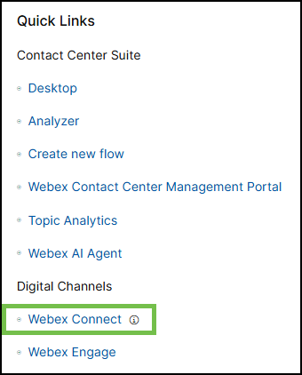{ width="300" }

- Create a new service by clicking **'Create New Service'** and providing a name (i.e. Webexone_carorderservice_Name_).

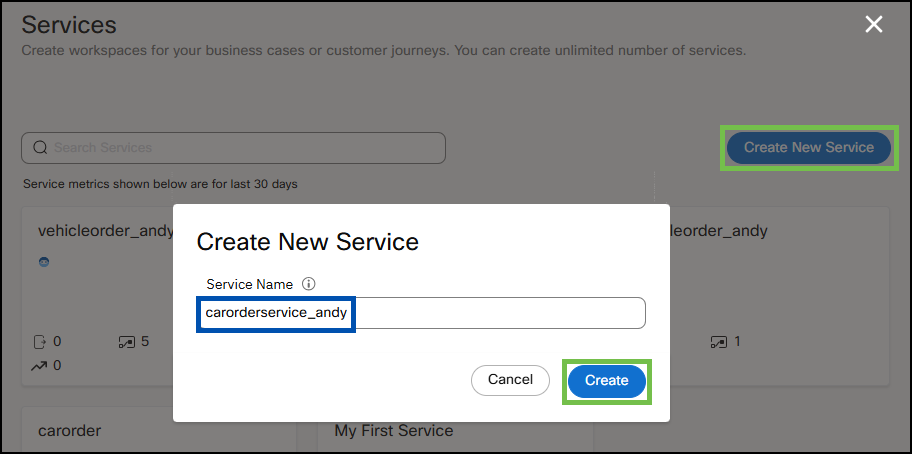{ width=800" }

- Navigate to **'Flows'** section and click **'Create Flow'**.

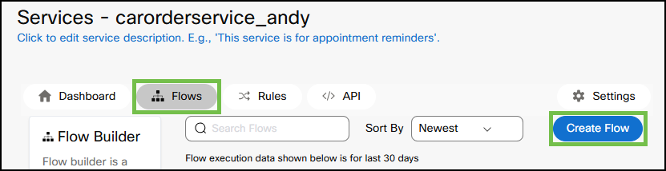{ width="800" }
  
- Proivde a **'Flow Name'** (i.e. _carcreateorder_name_), ensure that **'Start from Scrach'** is selected, and click **'Create'**. 

!!! info
	This flow will interact with external database using API to create a car order.

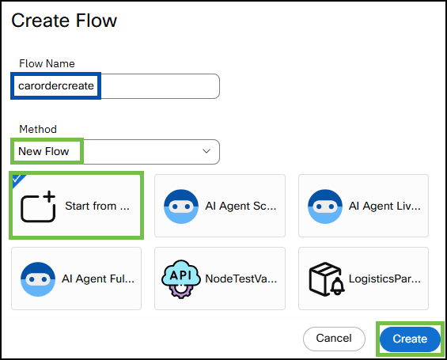{ width="500" }

- In the next menu, select **'AI Agent'** under **'Integrations'**.

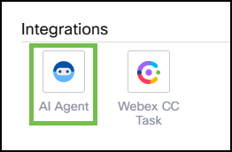{ width="300" }

- **'Configure AI Agent Event'** is displayed. Under **'Provide sample Json'** provide the variables that will be passed from the Webex AI Agent. For a new car order, use the following:
```ios
{
"model": "",
"color": "",
"engine": "",
"customer": ""
}
```
- Click **'Parse'** and **'Save'**.

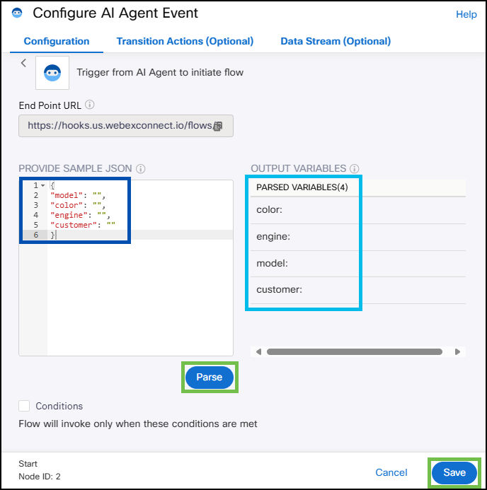{ width="500" }

- Drag the **'HTTP Request'** node from the left-hand side menu, place it next to the **'AI Agent'** node, and connect them by clicking and holding the green dot on the **'AI Agent'** node and dragging it to the **'HTTP Request'** node.

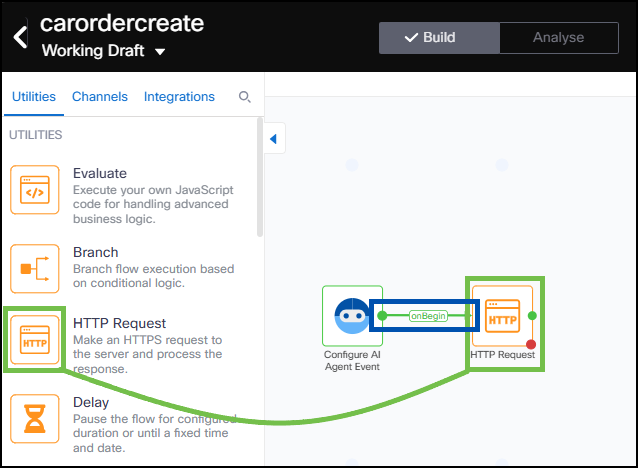{ width="600" }

- Double click on the **'HTTP Request'** node and fill the fields as follows:

| Field name                                | Value                                       |
| :---------------------------------------- | :------------------------------------------ |
| `Method`                                  | POST                                        |
| `Endpoint URL`                            | https://68085a3f942707d722ddf6a8.mockapi.io/api/cars                       |
| `Header`                           	    | Content-Type                                |
| `Value`                                   | application/json                            |
| `Output Variable Name` (click **'+Add Variable'**)    | orderid                                     |
| `Response Entity`                        | Body                                        |
| `Response Path`                           | $.orderid                                   |

For **'Body'** section use:
```ios
{
 "color": "$(n2.aiAgent.color)",
 "engine": "$(n2.aiAgent.engine)",
 "model": "$(n2.aiAgent.model)",
 "customer": "$(n2.aiAgent.customer)"
}
```

- Click **'Save'**.

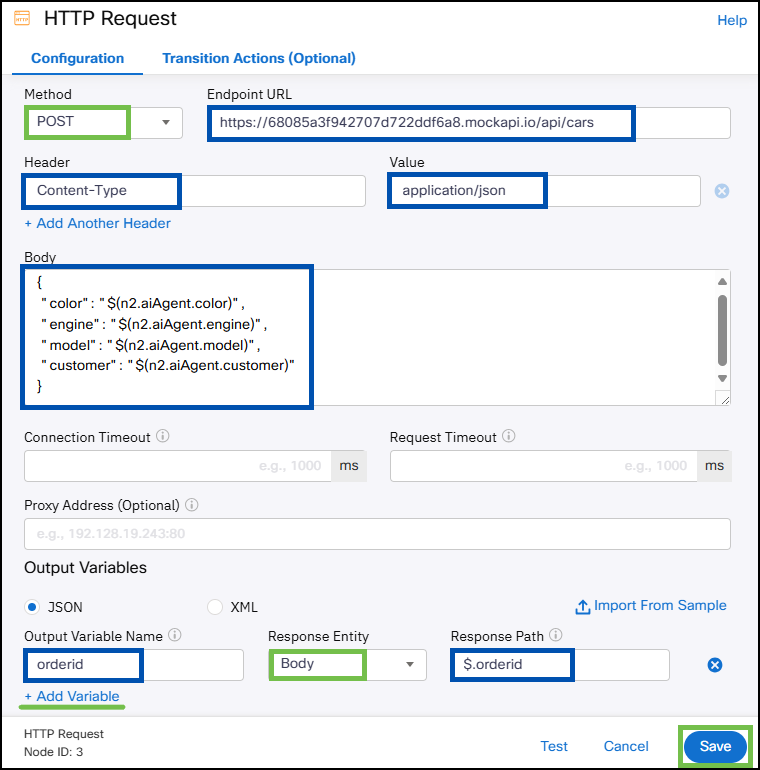{ width="600" }

- Configure **'HTTP Request'** node outcomes by dragging the orange, green, and red outcome dots to empty space on the canvas and selecting appropriate outcomes (e.g., **'onTimeout'** - Error, **'onSuccess'** - Success, **'onError'** - Error).

{ width="500" }
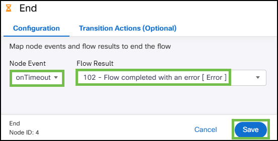{ width="500" }
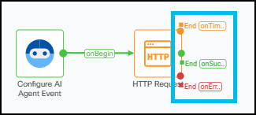{ width="500" }

- Next, click **'Flow Settings'** (gear icon), navigate to **'Flow Outcomes'**, and expand **'Last Execution Status'** outcome.
- Click **'Add New'**, use 'orderid' under **'Key'** and '$(n3.orderid)' under **'Value'**.
- Click **'Save'**.

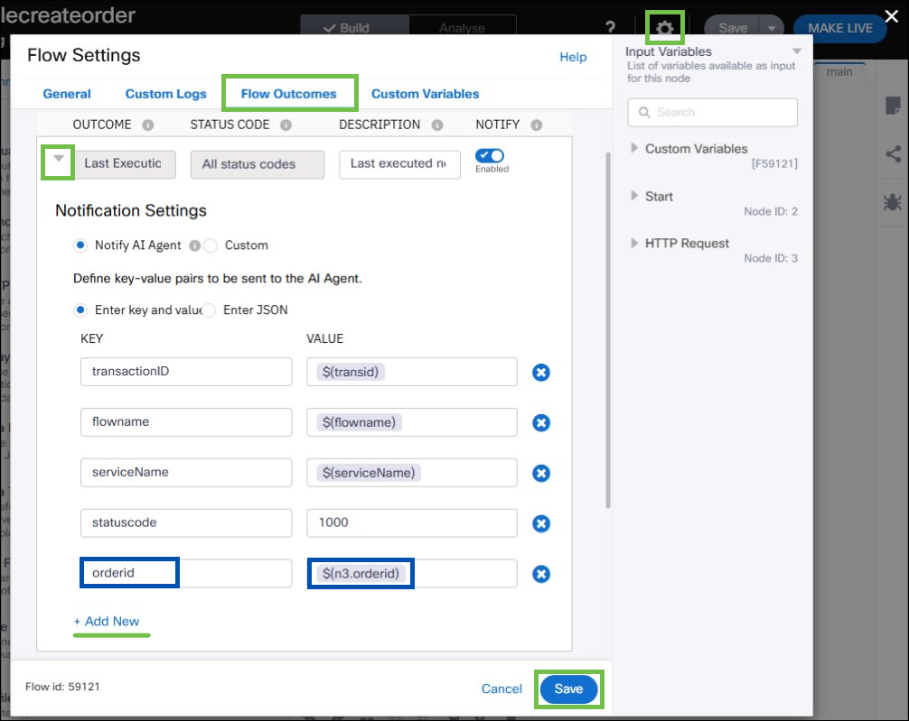{ width="1000" }

- Make the flow live by clicking **'Make Live'** (top right corner) and then clicking  **'Make Live'** again in the next dialog box.

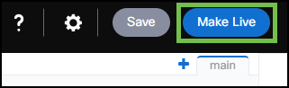{ width="400" }


## **Section 2 - Configure AI Agent Car Order Action**

- Navigate back to the AI Agent Studio and to your Autonomous Webex AI Agent.

- Select **'Actions'** and click **'New Action'**.

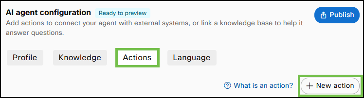{ width="600" }

- Provide an **'Action Name'** (use _carordercreate_).
- Provide the following **'Action description'**:
```ios
Submit a car order when the customer chooses a model and all other customization options.  
Provide orderid after a successful order.  
```
- Under **'Action scope'**, select **'Slot filling and fulfillment'**.

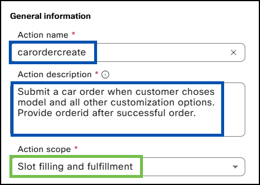{ width="500" }

- Select the service you created in the previous task under **'Select service'** and the flow created above under **'Select a flow'**.

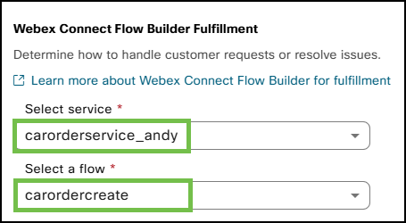{ width="500" }

- Click **'New input entity'**.

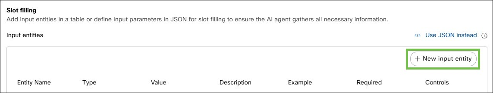{ width="1000" }

- Add four entities for the Webex AI Agent to pass to the Webex Connect flow with the following parameters:

| Entity name    | Entity type  | Entity description | Entity examples | Required |
| :------------- | :----------- | :----------------- | :-------------- | :--------|
| model        | String    | Car model that the customer chose | NovaTerra | Yes  |
| color        | String    | Car color that the customer chose | Ruby Red | Yes  |
| engine        | String    | Engine type that the customer chose | gas, electric | Yes  |
| customer        | String    | Customer's name | Jack, Nick | Yes  |

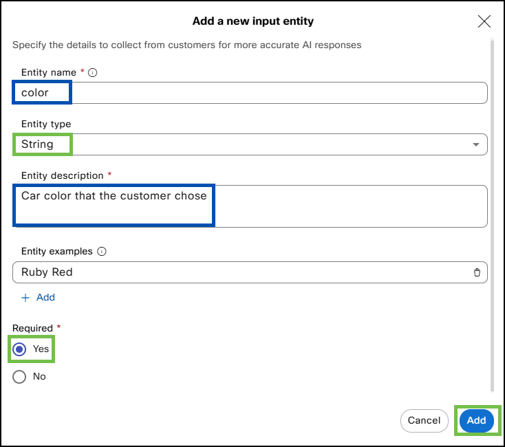{ width="600" }
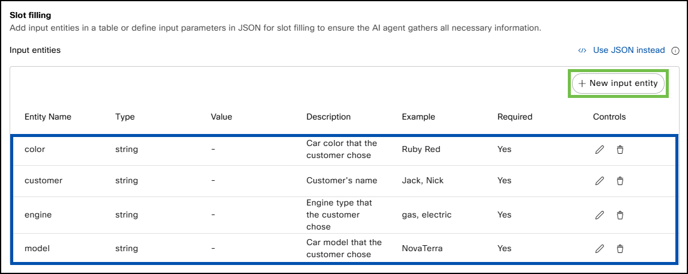{ width="1000" }

- Click **'Add'**.

{ width="200" }

## **Section 3 - Test Webex AI Agent**

- Let's test the logic by creating a new car order by going back to AI Agent Studio and selecting the Autonomous AI Agent created in exercise 1.

- Click 'Preview' and Verify the functionality by creating a car order. 

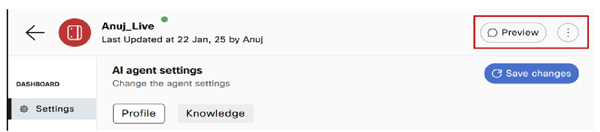{ width="300" }

- For guidance the screenshot provides an example of how an order is created. 
	- First, the user expressed the intent to buy a new car. 
	- As per its instructions, the AI agent requested car details like the model, engine type, and color. 
	- When a detail was missed, the agent was able to ask the user to provide the missing parameter to complete the order. 
	- Once it received all the necessary information, it successfully created the order and provided the order details. 

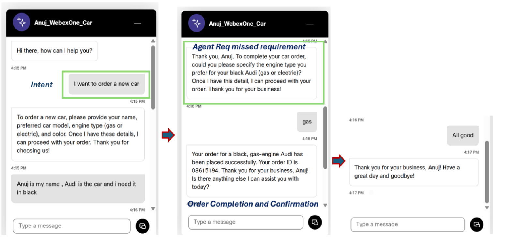{ width="500" }

- You can also access the datastore where these orders are stored and updated by entering the following URL into your browser:
   https://68085a3f942707d722ddf6a8.mockapi.io/api/cars.

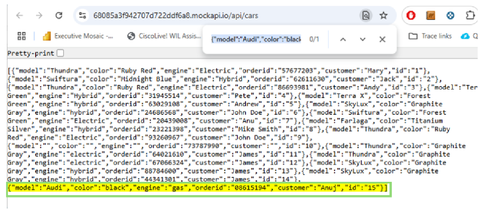{ width="500" }

- Lets verify the session details to confirm what actions where taken , knowledge used etc. 

- Select the  'Sessions' option in the left-hand menu and select a Session ID

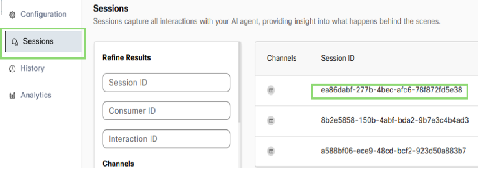{ width="500" }

- Review each message and observe the actions taken, knowledge used, etc., by the Webex AI Agent on the right-hand side

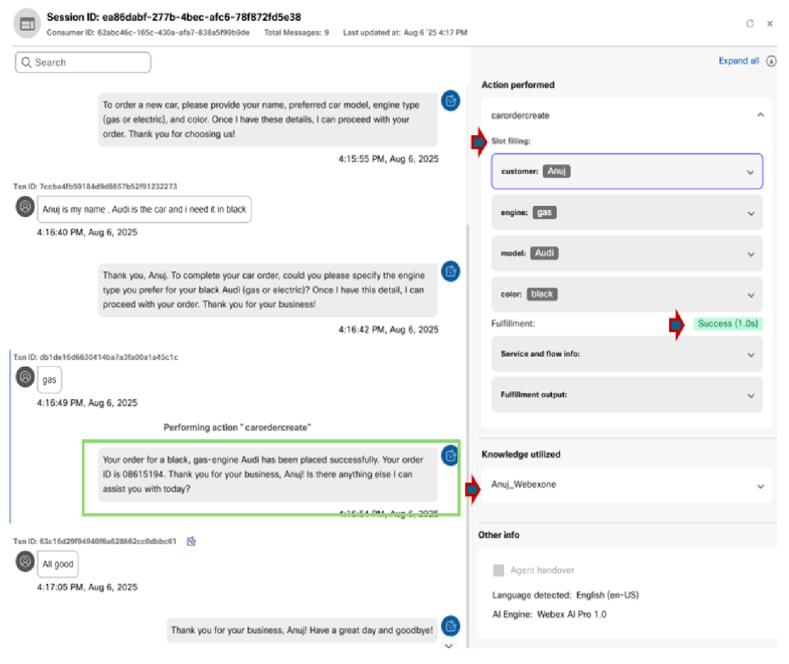{ width="500" }

Congratulations! You have successfully completed this task and the lab! If you'd like, you can also explore Bonus section 4 to dive and see how the orders can be modified. 

## **Section 4 - Car Order Actions with Webex AI Agent**

To make the Agent more capable, additional bot actions are needed. The configuration process is very similar to the one completed above for order creation. For simplicity, Webex Connect flows for these next actions are already prebuilt and will not require manual configuration.


**Car order check action**

- In the AI Agent Studio, navigate to your Autonomous Webex AI Agent.
- Select **'Actions'** and click **'New Action'**.
- Provide **'Action Name'** (use _carordercheck_).
- Provide the follwoing **'Action description'**:
```ios
Check an existing car order and provide details about the order - model, color, engine type, and orderid.  
```
- Under **'Action scope'**, select **'Slot filling and fulfillment'**.

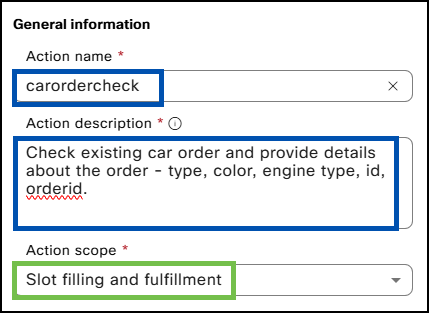{ width="500" }

- Select the prebuilt service _CiscoLive25AIAgentFlows_ under **'Select service'** and the _carordercheck_ flow under **'Select a flow'**.

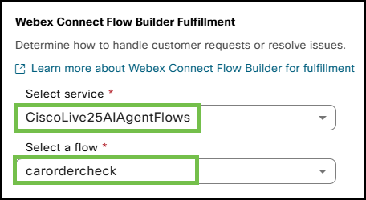{ width="500" }

- Click **'New input entity'**.


| Entity name    | Entity type  | Entity description | Entity examples | Required |
| :------------- | :----------- | :----------------- | :-------------- | :--------|
| orderid        | String    | orderid provided by the customer | 5345321 | Yes  |

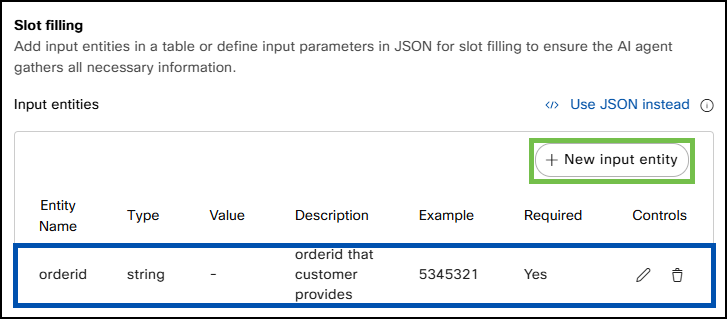{ width="800" }

- Click **'Add'**.


**Car order modify action**

- In the AI Agent Studio, navigate to your Autonomous Webex AI Agent.
- Select **'Actions'** and click **'New Action'**.
- Provide **'Action Name'** (use _carordermodify_).
- Provide the following **'Action description'**:
```ios
Collect the orderid  and modify the order as per the customer's request. 
```
- Under **'Action scope'**, select **'Slot filling and fulfillment'**.

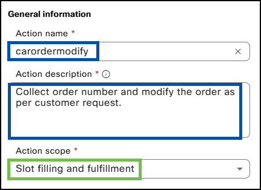{ width="500" }

- Select the prebuilt service _CiscoLive25AIAgentFlows_ under **'Select service'** and the _carordermodify_ flow under **'Select a flow'**.

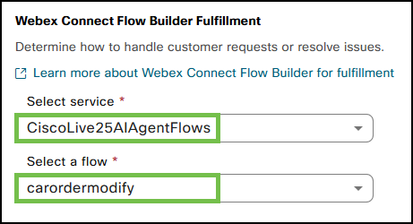{ width="500" }

- Add five entities for the Webex AI Agent to pass to the Webex Connect flow.
- Click **'New input entity'**.


| Entity name    | Entity type  | Entity description | Entity examples | Required |
| :------------- | :----------- | :----------------- | :-------------- | :--------|
| orderid        | String    | Order Id of the existing order | 5345321 | Yes  |
| model        | String    | Car model that the customer chose | NovaTerra | No  |
| color        | String    | Car color that the customer chose | Ruby Red | No  |
| engine        | String    | Engine type that the customer chose | gas, electric | No  |
| customer        | String    | Customer's name | Jack, Nick | No  |

- Click **'Add'**.

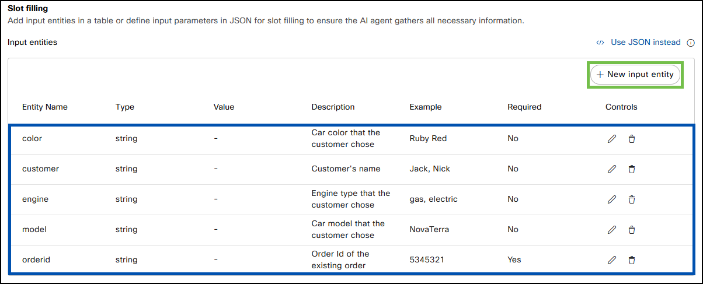{ width="1200" }


**Car order delete action**

- In the AI Agent Studio, navigate to your Autonomous Webex AI Agent.
- Select **'Actions'** and click **'New Action'**.
- Provide **'Action Name'** (use _carorderdelete_).
- Provide the follwoing **'Action description'**:
```ios
Delete the order when requested.
```
- Under **'Action scope'**, select **'Slot filling and fulfillment'**.

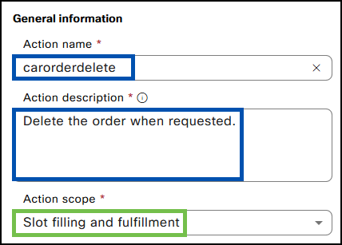{ width="500" }

- Select the prebuilt service _CiscoLive25AIAgentFlows_ under **'Select service'** and the _carorderdelete_ flow under **'Select a flow'**.

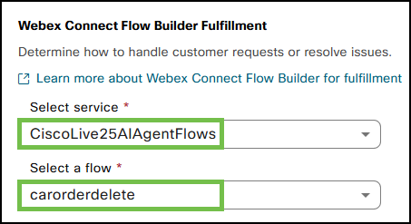{ width="500" }

- Click **'New input entity'**.


| Entity name    | Entity type  | Entity description | Entity examples | Required |
| :------------- | :----------- | :----------------- | :-------------- | :--------|
| orderid        | String    | 	Orderid provided by the customer | 5345321 | Yes  |

- Click **'Add'**.

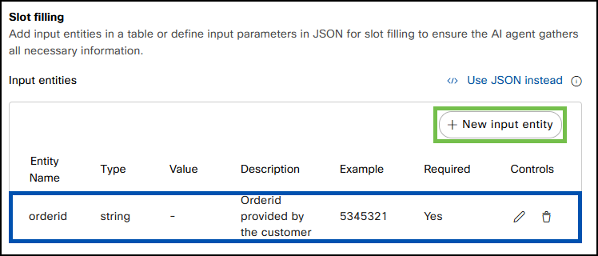{ width="800" }

- Save the Webex AI Agent configuration by clicking **'Save Changes'**, and publish by clicking **'Publish'** (provide comments for version tracking purposes).

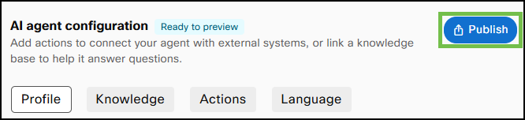{ width="600" }
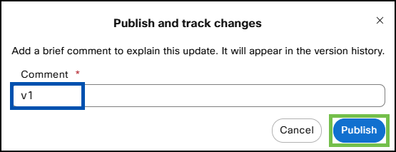{ width="600" }

- Congratulations! You have completed this task.