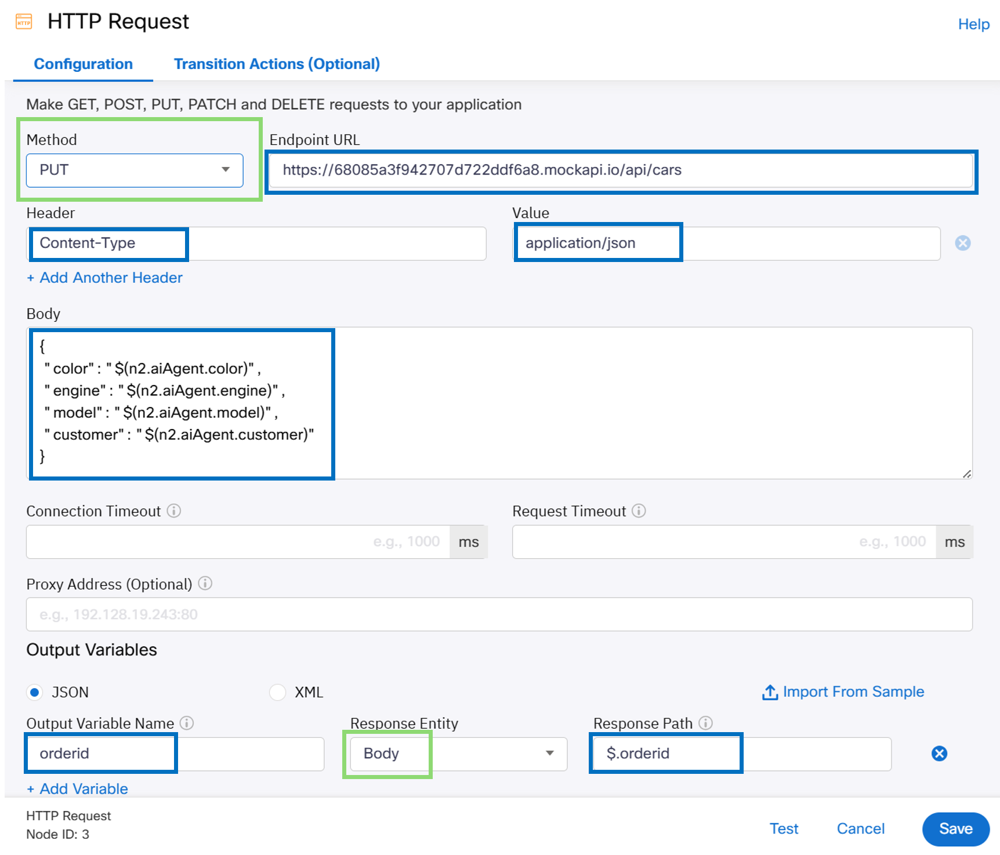

# Task 2 - Build Autonomous Webex AI Agent Actions

Please use the following credentials to connect to Control Hub and configure Webex Contact Center:

| <!-- -->         | <!-- -->         |
| ---------------- | ---------------- |
| `Control Hub URL`            | <a href="https://admin.webex.com" target="_blank">https://admin.webex.com</a> |
| `Username`       | wxccemealabs+admin**ID**@gmail.com  _(where **ID** is your assigned pod number; this ID will be provided by your proctor)_ |
| `Password`       | ciscoliveAMER25! |

## **Objective**

In this lab, audience will learn to explore and set up Autonomous Webex AI Agent actions using Webex Connect flows. They will also learn how to configure these flows to interact with external APIs, allowing the AI Agent to handle data and fulfill requests by connecting to other services.

## **Section 1 : Create a Webex Connect Flow for Car Order**

- Action fulfillment for the agent is always handled via Webex Connect flows. 

- Lets begin by creating a Webex Connect flow, which can later be selected to a specific Webex AI action.

- Navigate to the Webex Connect portal through the **'Quick Links'** section in the Webex Contact Center area of Control Hub.

{ width="300" }

- Create a new service by clicking **'Create New Service'** and providing a name (i.e. Webexone_carorderservice_Name_).

{ width=800" }

- Navigate to **'Flows'** section and click **'Create Flow'**.

{ width="800" }
  
- Proivde a **'Flow Name'** (i.e. _carcreateorder_name_), ensure that **'Start from Scrach'** is selected, and click **'Create'**. 

!!! info
	This flow will interact with external database using API to create a car order.

{ width="500" }

- In the next menu, select **'AI Agent'** under **'Integrations'**.

{ width="300" }

- **'Configure AI Agent Event'** is displayed. Under **'Provide sample Json'** provide the variables that will be passed from the Webex AI Agent. For a new car order, use the following:
```ios
{
"model": "",
"color": "",
"engine": "",
"customer": ""
}
```
- Click **'Parse'** and **'Save'**.

{ width="500" }

- Drag the **'HTTP Request'** node from the left-hand side menu, place it next to the **'AI Agent'** node, and connect them by clicking and holding the green dot on the **'AI Agent'** node and dragging it to the **'HTTP Request'** node.

{ width="600" }

- Double click on the **'HTTP Request'** node and fill the fields as follows:

| Field name                                | Value                                       |
| :---------------------------------------- | :------------------------------------------ |
| `Method`                                  | PUT                                       |
| `Endpoint URL`                            | https://68085a3f942707d722ddf6a8.mockapi.io/api/cars                       |
| `Header`                           	    | Content-Type                                |
| `Value`                                   | application/json                            |
| `Output Variable Name` (click **'+Add Variable'**)    | orderid                                     |
| `Response Entity`                        | Body                                        |
| `Response Path`                           | $.orderid                                   |

For **'Body'** section use:
```ios
{
 "color": "$(n2.aiAgent.color)",
 "engine": "$(n2.aiAgent.engine)",
 "model": "$(n2.aiAgent.model)",
 "customer": "$(n2.aiAgent.customer)"
}
```

- Click **'Save'**.

{ width="800" }

- Configure **'HTTP Request'** node outcomes by dragging the orange, green, and red outcome dots to empty space on the canvas and selecting appropriate outcomes (e.g., **'onTimeout'** - Error, **'onSuccess'** - Success, **'onError'** - Error).

{ width="500" }
{ width="500" }
{ width="500" }

- Next, click **'Flow Settings'** (gear icon), navigate to **'Flow Outcomes'**, and expand **'Last Execution Status'** outcome.
- Click **'Add New'**, use 'orderid' under **'Key'** and '$(n3.orderid)' under **'Value'**.
- Click **'Save'**.

{ width="900" }

- Make the flow live by clicking **'Make Live'** (top right corner) and then clicking  **'Make Live'** again in the next dialog box.

{ width="400" }


## **Section 2 - Configure AI Agent Car Order Action**

- Navigate back to the AI Agent Studio and to your Autonomous Webex AI Agent.

- Select **'Actions'** and click **'New Action'**.

{ width="600" }

- Provide an **'Action Name'** (use _carordercreate_).
- Provide the following **'Action description'**:
```ios
Submit a car order when the customer chooses a model and all other customization options.  
Provide orderid after a successful order.  
```
- Under **'Action scope'**, select **'Slot filling and fulfillment'**.

{ width="500" }

- Select the service you created in the previous task under **'Select service'** and the flow created above under **'Select a flow'**.

{ width="500" }

- Click **'New input entity'**.

{ width="1000" }

- Add four entities for the Webex AI Agent to pass to the Webex Connect flow with the following parameters:

| Entity name    | Entity type  | Entity description | Entity examples | Required |
| :------------- | :----------- | :----------------- | :-------------- | :--------|
| model        | String    | Car model that the customer chose | NovaTerra | Yes  |
| color        | String    | Car color that the customer chose | Ruby Red | Yes  |
| engine        | String    | Engine type that the customer chose | gas, electric | Yes  |
| customer        | String    | Customer's name | Jack, Nick | Yes  |

{ width="600" }
{ width="1000" }

- Click **'Add'**.

{ width="200" }

## **Section 3 - Test Webex AI Agent**

- Let's test the logic by creating a new car order by going back to AI Agent Studio and selecting the Autonomous AI Agent created in exercise 1.

- Click 'Preview' and Verify the functionality by creating a car order. 

{ width="200" }

- For guidance the screenshot provides an example of how an order is created. 
	- First, the user expressed the intent to buy a new car. 
	- As per its instructions, the AI agent requested car details like the model, engine type, and color. 
	- When a detail was missed, the agent was able to ask the user to provide the missing parameter to complete the order. 
	- Once it received all the necessary information, it successfully created the order and provided the order details. 

{ width="1000" }

- In your case, you will see that the agent is not able to provide the order ID. Specifically asking the agent for the order ID was not helpful either.

{ width="300" }

- To begin, verify the session details to confirm the agent's actions by going into the Agent and Sessions Section. 

{ width="900" }

- Choose the latest Session ID. 

- Note that the fulfillment was successful, and information was provided to the Connect Flow for order execution.

{ width="800" }

- Next, lets examine the Connect Flow debugs to see how the information was executed. 

- To access these, navigate to Control Hub > Contact Center Quick Links > Webex Connect, and then select the Connect service you created.

{ width="800" }

- Within the service, select your created Flow and click the Debug option on the right side. The Transaction Logs window will open.

{ width="800" }

- First, click Decrypt Logs to convert the logs into text, then select the latest transaction. 

{ width="800" }

- You will see three nodes being executed. 

- The "Configure AI Agent Event" payload is constructed and passed to the "HTTP Request Node."

{ width="800" }

- In the HTTP Request Node, you'll see the request data was constructed and the API was executed. However, the response data shows a status of 400 Bad Request, indicating the request was not processed due to an invalid request.

{ width="900" }

- The issue lies in the method selected to create the record. PUT is generally used for updating or replacing existing content, but for creating a new record, the correct method is POST.

- To correct this, select the Edit option in the flow. In the HTTP Request Node, change the Method from PUT to POST.

{ width="900" }

- Save the flow and make it Live.

- Create a car order again from Preview chat, and the execution should now be successful.

- You can also access the datastore where these orders are stored and updated by entering the following URL into your browser:
   https://68085a3f942707d722ddf6a8.mockapi.io/api/cars

{ width="500" }

Congratulations! You have successfully completed this task and the lab! If you'd like, you can also explore Bonus section 4 to dive and see how the orders can be modified. 
