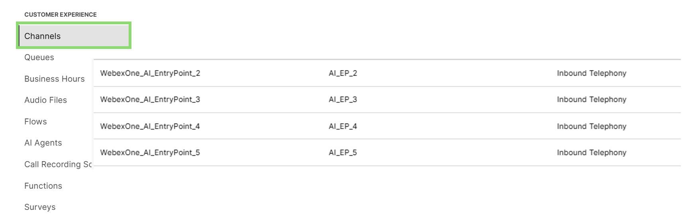

# Lab 3 - Create and Test Voice Flows for Webex AI Agents

Please use the following credentials to connect to Control Hub and configure Webex Contact Center:

| <!-- -->         | <!-- -->         |
| ---------------- | ---------------- |
| `Control Hub URL`            | <a href="https://admin.webex.com" target="_blank">https://admin.webex.com</a> |
| `Username`       | wxccemealabs+admin**ID**@gmail.com  _(where **ID** is your assigned pod number; this ID will be provided by your proctor)_ |
| `Password`       | ciscoliveAMER25! |

## **Objective**

This lab exercise aims to guide participants in creating and configuring a voice flow for an Autonomous Webex AI Agent that was set up in a previous exercise. Participants will then interact with the AI Agent via a phone call to test the voice flow. 

This exercise will also provide an opportunity to experience the AI Assistant feature of the contact center by highlighting the virtual agent's conversation summary when the call is escalated to a live agent

## **Section 1 - Voice flow configuration**

- Navigate to the Control Hub and log in using the credentials provided above.
- After logging in to the Control Hub, navigate to the **'Flows'** menu on the-left hand side.
- Click **'Manage Flows'** and select **'Create Flows'**.

{ width="1000" }

- When prompted to **'Choose a method'**, select **'Flow Templates'**.

{ width="800" }

- Choose **'AI Agent Autonomous (Package Tracking)'**, click **'Next'**, provide a flow name (e.g., '_ai_agent_autonomous_andy_'), and click **'Create Flow'**.

{ width="500" }
{ width="500" }

- Once the flow loads, click on the **'VirtualAgentV2'** node and select the Webex AI Agent (created in **Excercise 1**) under **'Virtual Agent'**.

{ width="1000" }

- Click on the **'QueueContact'** node and select **'WebexOne_AIQueue_<n>'** (where **'N'** is your lab user number).

{ width="1000" }

- Click on an empty space in the flow, then on the right-hand side, navigate to **'Global Variables'**. Click on **'Global_VoiceName'**, select edit option (pencil icon), use 'en-US-Jess' for **'Default Value'**, and click **'Save'**.

{ width="1000" }

Note !!!
	Instead of Jess as the voice, you can choose different voice options like **'en-US-Maria'** and **'en-US-Henry'**. Supported voice languages for AI agents can be checked via <a href="https://help.webex.com/en-us/article/pdef2d/Supported-languages-and-voices-for-AI-agents" target="_blank">Supported Languages and Voices for AI agents.
	

- Turn Flow Validation **'On'** by clicking the **'Validation'** button at the bottom of the page to publish the flow. Once validation is complete, click **'Publish Flow'** and then **'Publish Flow'** again in the next dialog box (**Latest** version label is selected automatically).

{ width="400" }

- Navigate to **'Channels'** menu in the Webex Contact Center configuration.
- Open **'WebexOne_AI_EntryPoint_N'** (_where **'N'** is your lab user number), associate your created flow under **'Routing Flow'** (note down the **'Support Number'** associated with this channel - it will be needed later in this lab for testing), and click **'Save'**.

{ width="500" }
{ width="1000" }

## **Section 2 - Verifying Voice Flow, Agent Handover and AI Assistant Summary**

- Log in to the Webex Contact Center Agent Desktop:
	- For the phone number, select **'Desktop'** 
	- For the team use **WebexOne_Team_N** (where **'N'** is your lab user number)'.

???????<<<ScreenShot>>>???????????

- Call the channel number (from the steps above), interact with the Webex AI Agent and order the car and get the order ID. 

Congratulations! You have completed this task and the lab!