# Excercise 4 - Explore Webex AI Assistant Feature 

Please use the following credentials to connect to Control Hub and configure Webex Contact Center:

| <!-- -->         | <!-- -->         |
| ---------------- | ---------------- |
| `Control Hub URL`            | <a href="https://admin.webex.com" target="_blank">https://admin.webex.com</a> |
| `Username`       | wxccemealabs+admin**ID**@gmail.com  _(where **ID** is your assigned pod number; this ID will be provided by your proctor)_ |
| `Password`       | ciscoliveAMER25! |

## **Objective**

This lab's objective is to provide participants with a basic understanding of the AI Assistant feature in the Webex Contact Center and demonstrate how it enhances the live agent experience.

Building on previous labs that showcased how Webex AI Agents assist customers with inquiries and actionable tasks, this lab will focus on the AI Assistant's role when a customer's call is escalated to a live agent. You will explore, configure, and test the following AI capabilities:

- **AI Agent Transfer Summaries** : See how the AI provides a summary of the conversation when a virtual agent transfers a call to a human agent, giving the agent full context.

- **Call Drop Summaries** : Learn how the AI generates a summary for a new agent if a customer's call is disconnected and they call back, ensuring they don't have to repeat themselves.

- **Real-time Transcriptions** : Experience how this feature provides a live, real-time transcription of the conversation for agents , improving clarity and customer satisfaction.

## **Section 1: AI Agent Transfer Summary**

- To achieve this objective, we must first ensure that the all the summary and transcripts feature is enabled for the tenant. 

- To check this, Log in to <a href="https://admin.webex.com" target="_blank">https://admin.webex.com</a> with the provided credentials.

- In Control Hub, under Services, click on Contact Center. Then, under Contact Center navigation pane on the left side, scroll down to DESKTOP EXPEREINCE section and click on Cisco AI Assistant.

	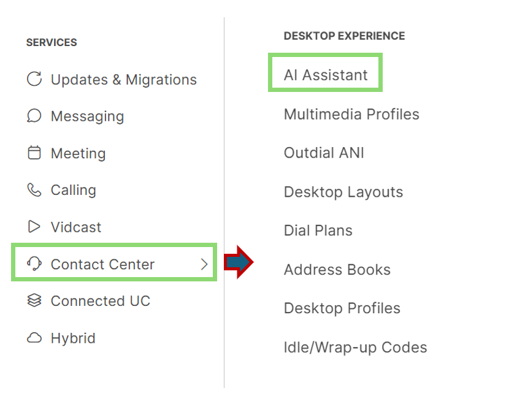{ width="500" }

- Ensure that the "Call Drop Summary" , "Virtual Agent Transfer Summary" & "Real Time Transcripts"  toggle is enabled.

	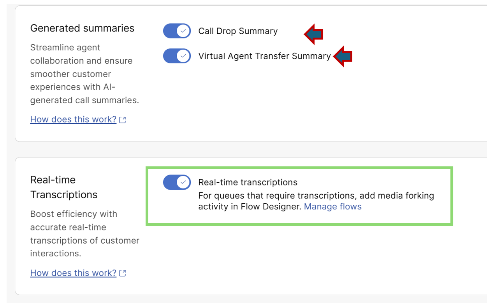{ width="600" }

- The next step is to configure the AI Assistant widget for agent use. 

- To accomplish this, the agent's desktop layout must include the "ai-assistant" JSON string in the Agent > Advanced Header section

- You can review this in Control Hub by navigating to "Desktop Layouts" within the "Desktop Experience" section of the Contact Center services.

	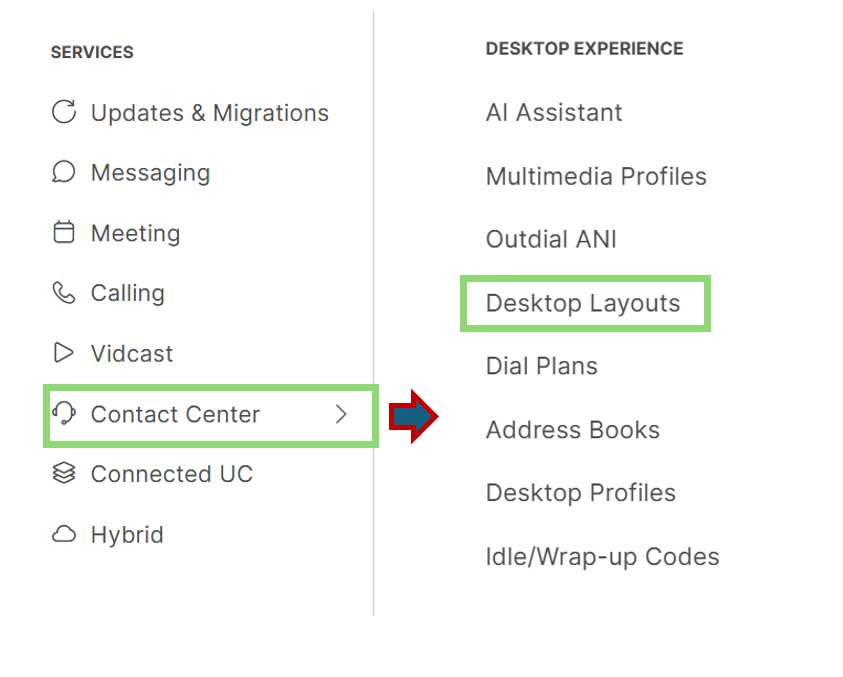{ width="550" }

- Search and Open the layout **Wx1_Desktop_AI_Assistant** and download the file **Wx1_Desktop_AI_Assistant.json**.

	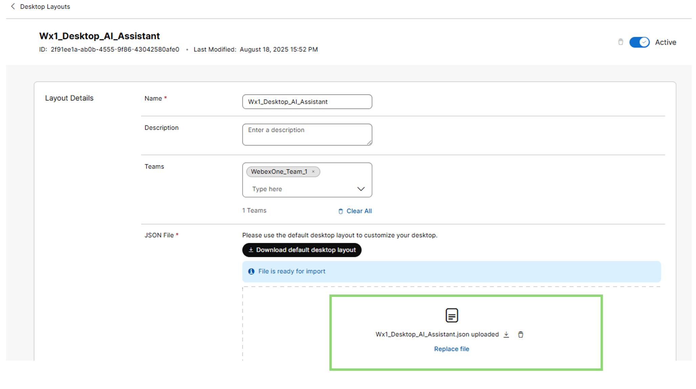{ width="700" }
  
- Review the file in a text editor. In the Agent > Advanced Header section, you should see the verbiage highlighted in this screenshot

	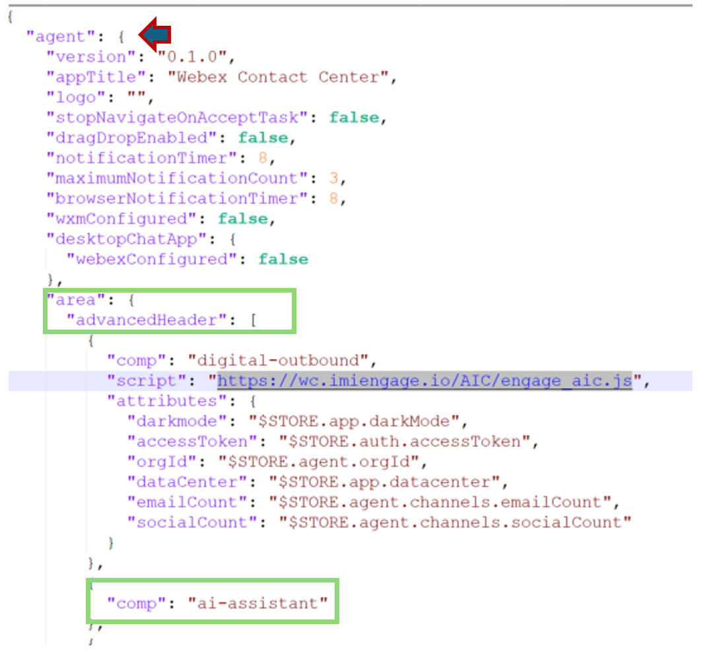{ width="500" }

- To have a desktop layout reflected for agents, it must be mapped to their teams.

- From User Management section of Control Hub, select Teams and search for your team **WebexOne_Team_<num>** you want to update.

	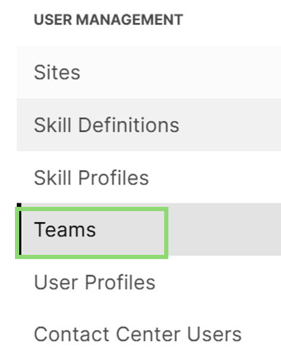{ width="200" }

- In the Desktop Layout field of the team setting, ensure that the layout  **Wx1_Desktop_AI_Assistant** is selected and saved.

	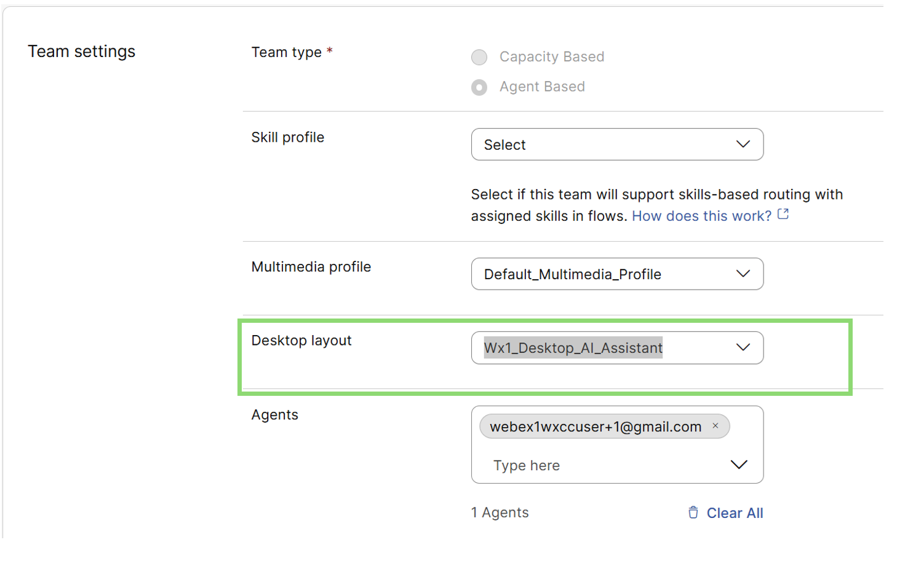{ width="700" }
  
- Now, log in to the Agent Desktop using the provided credentials.
  	- URL: <a href="https://desktop.wxcc-us1.cisco.com/" target="_blank">https://desktop.wxcc-us1.cisco.com/</a>
  	- Username: `Contact the lab proctor if information is unavailable.`  
  	- Password: `Contact the lab proctor if information is unavailable.`
	
- Please select **Desktop** as the telephony option and set the Team as **WebexOne_Team_<num>**

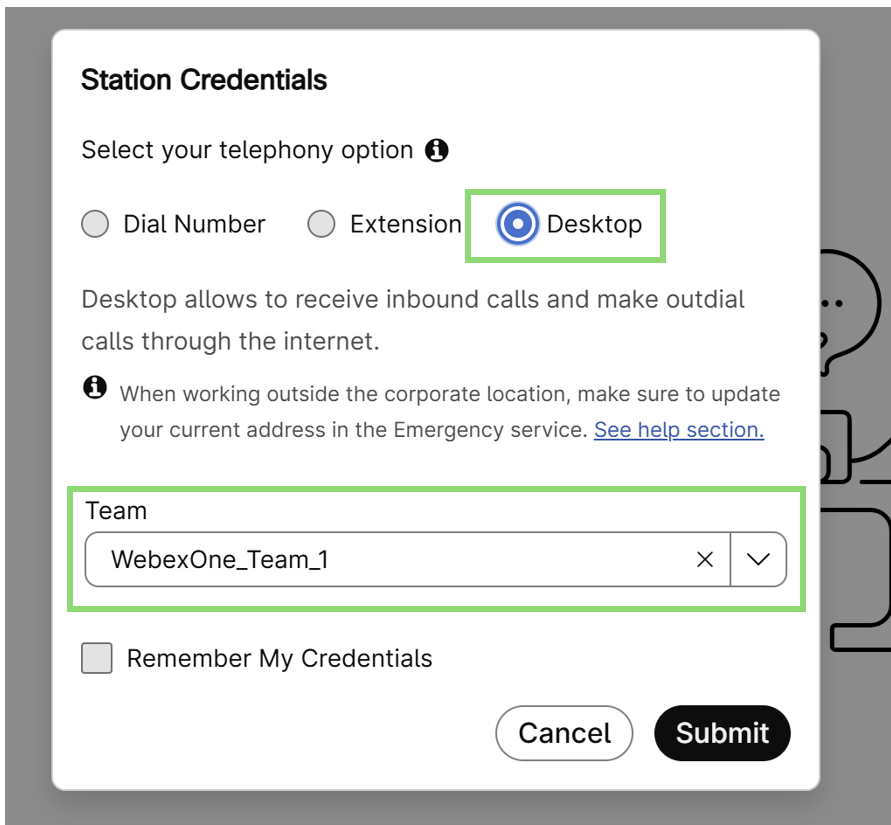{ width="500" }

- This will load the layout as configured above.

- You will notice the AI Assistant and its capabilities loaded.

	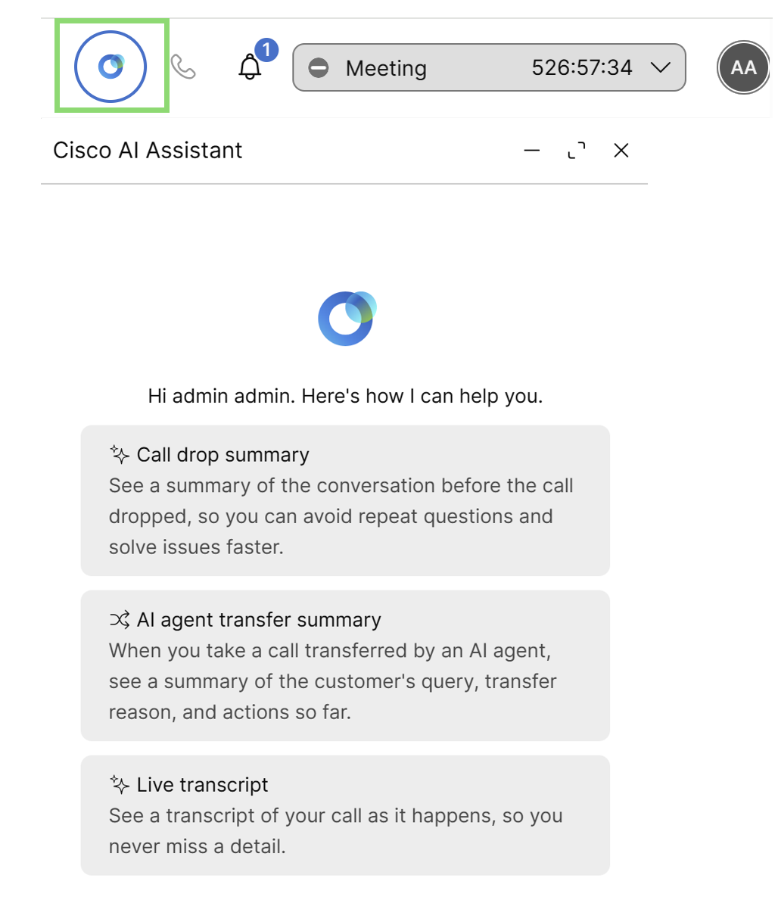{ width="500" }

- Ensure the agent is set to the "Available" state.

- Using your cell phone, call the same number as in previous excercise. 

- After speaking briefly with the AI agent, you can escalate the call to a live agent by saying, **I want to speak to an agent**.

- Switch the agent to '**Available**' state on the Webex Contact Center Agent Desktop and accept the call.

- Observe the AI Assistant summary of your conversation with the agent and all the interactions with the AI agent in the IVR transcripts section. 

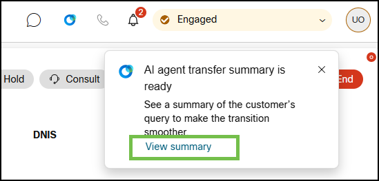{ width="600" }
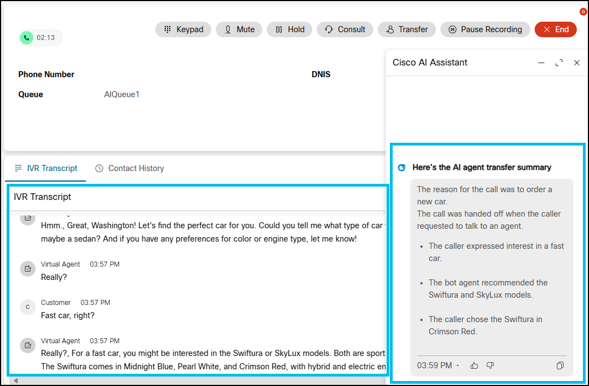{ width="800" }

- Have a brief conversation with the agent, ensure it's not more than **10 or 15** seconds long, and end the call from the cell phone. 

## **Section 2: Call Drop Summary**

- Now, if another call is made that is escalated and presented to an agent, you might expect a call drop summary to appear when the agent accepts the call.

- Let's make a call and observe the behavior.

- You will notice that the summary is not generated when the call is presented to the agent and they answer it.

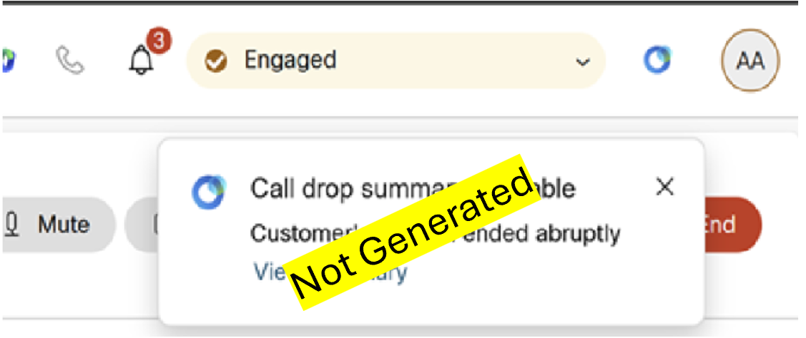{ width="600" }

- This time, continue the conversation with the agent for more than **40 seconds**, then end the call from the caller's end.

- Now, when you call back and the agent accepts the call, the call drop summary will be generated.

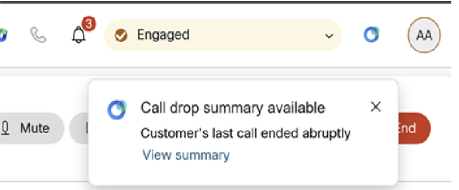{ width="600" }

- The reason this works is that the call has met the following criteria:

	- Recording for these calls is enabled.
	- The callback to the contact center is within a 24-hour window.
	- The callback came from the same phone number (ANI) as the original call.
	- The call was longer than 30 seconds.

- More details can be reviewed in this section <a href="https://help.webex.com/article/ndt475w" target="_blank">Frequently Asked Questions (FAQs)</a> 

## **Section 3: Live Transcripts**

- Real-time transcriptions feature allows agents to access real-time conversation with the caller on their Agent Desktop, enabling them to follow conversations more accurately and respond effectively.

- While completing the "Call Drop Summary" exercise, you may have noticed that transcripts were not visible for the calls, even though the option was enabled in Control Hub along with the "Call Drop Summary" feature.

	{ width="600" }

- This is because, in addition to the tenant-level settings, a "Media Stream" activity must be triggered directly after the agent answers the call.

- This can be achieved in a flow in one of two ways:
	- Enable media stream for all queues in the flow.
	- Enable media stream for specific queues in the flow.

- For this exercise, we will proceed by enabling media stream for all queues in the flow as we have only one queue. 

- In Control Hub go to the Flows menu on the left-hand side.

	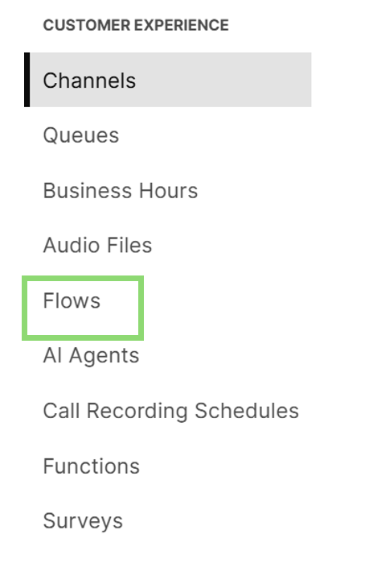{ width="250" }

- Search for and select the voice flow you created for the AI Agent exercise.

- On the event flow canvas, click the Edit option.

	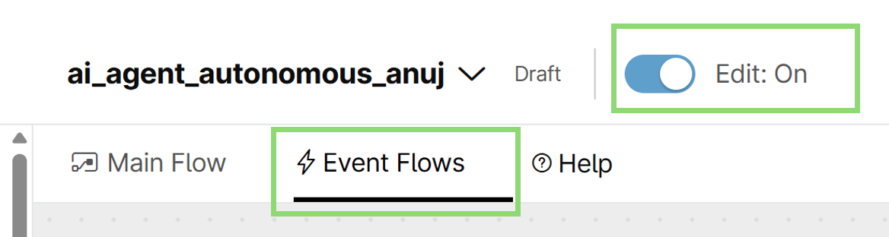{ width="500" }

- Add a Start Media Stream activity node directly after the AgentAnswered event. Make sure the activity is connected to the End Flow Node.

	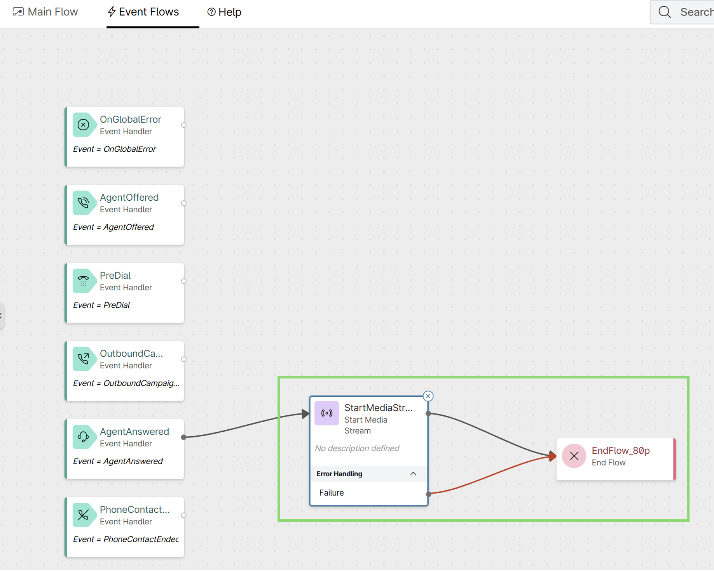{ width="600" }

- Validate and Publish the flow. This will enable real-time transcription for every call routed through this flow.

	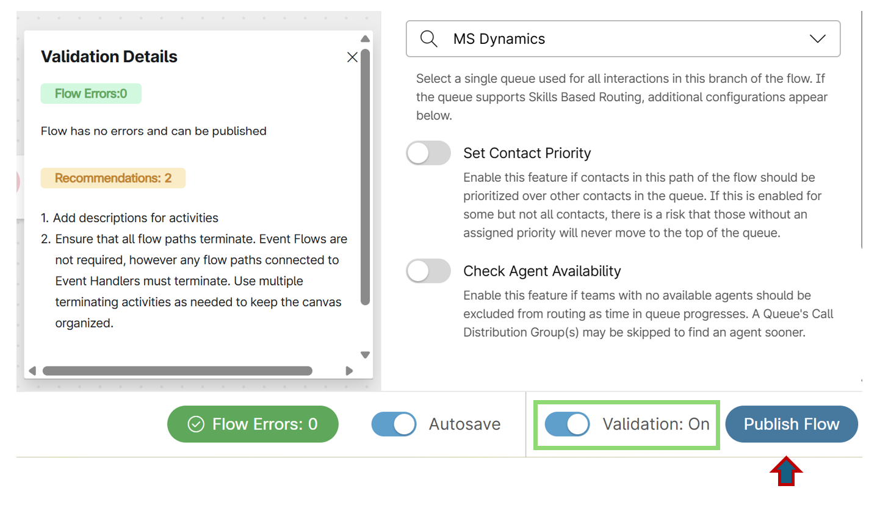{ width="700" }

- Now, lets test the transcription feature 

- Ensure your agent is logged in and set to available.

- Make a call and after the interaction with the AI agent, escalate the call to your agent.

- Accept the call and observe the conversation being converted into real-time transcripts in the Transcripts gadget.

	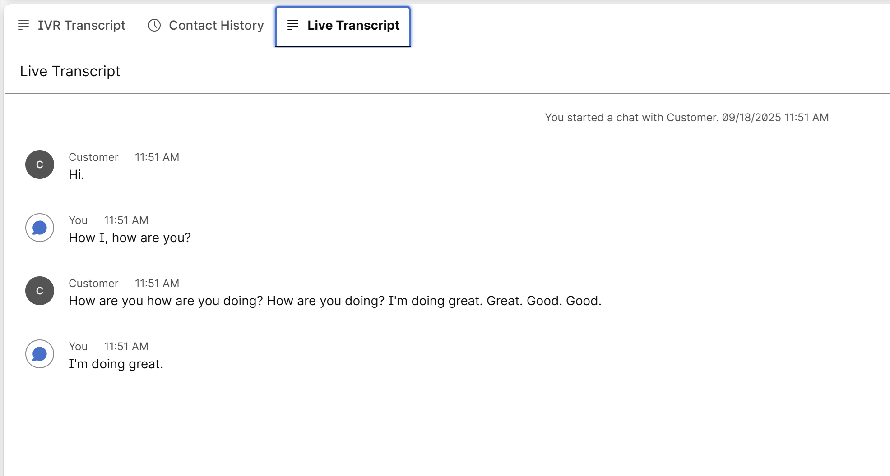{ width="700" } 

- If your business requires enabling real-time streaming for specific queues only, you can follow the instructions in the provided document at <a href="https://help.webex.com/en-us/article/n5jhgdi/Enabling-media-streaming-for-specific-queues" target="_blank">Enabling media streaming for specific queues </a>

# Results

Congratulations, In this lab, you learned how the AI Assistant enhances the live agent experience. By providing AI Agent Transfer Summaries and Call Drop Summaries, the assistant gives agents instant context. Paired with Real-time Transcriptions, these features ensure agents are always well-informed, leading to more efficient and satisfying customer interactions.
