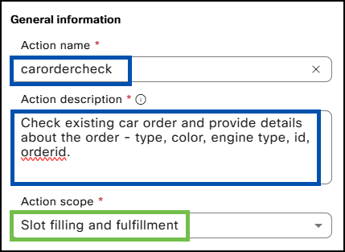
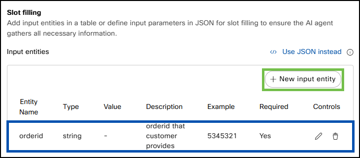
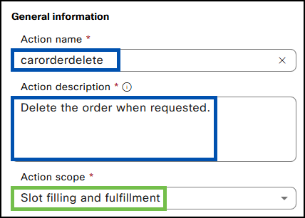

# Excercise 5 - (Bonus) Car Order Actions with Webex AI Agent (Bonus)

Please use the following credentials to connect to Control Hub and configure Webex Contact Center:

| <!-- -->         | <!-- -->         |
| ---------------- | ---------------- |
| `Control Hub URL`            | <a href="https://admin.webex.com" target="_blank">https://admin.webex.com</a> |
| `Username`       | wxccemealabs+admin**ID**@gmail.com  _(where **ID** is your assigned pod number; this ID will be provided by your proctor)_ |
| `Password`       | ciscoliveAMER25! |

## **Steps**

To make the AI Agent more capable, additional bot actions are needed. The configuration process is very similar to the one completed above for order creation. For simplicity, Webex Connect flows for these next actions are already prebuilt and will not require manual configuration.


**Car order check action**

- In the AI Agent Studio, navigate to your Autonomous Webex AI Agent.
- Select **'Actions'** and click **'New Action'**.
- Provide **'Action Name'** (use _carordercheck_).
- Provide the follwoing **'Action description'**:
```ios
Check an existing car order and provide details about the order - model, color, engine type, and orderid.  
```
- Under **'Action scope'**, select **'Slot filling and fulfillment'**.

{ width="500" }

- Select the prebuilt service _CiscoLive25AIAgentFlows_ under **'Select service'** and the _carordercheck_ flow under **'Select a flow'**.

{ width="500" }

- Click **'New input entity'**.


| Entity name    | Entity type  | Entity description | Entity examples | Required |
| :------------- | :----------- | :----------------- | :-------------- | :--------|
| orderid        | String    | orderid provided by the customer | 5345321 | Yes  |

{ width="800" }

- Click **'Add'**.


**Car order modify action**

- In the AI Agent Studio, navigate to your Autonomous Webex AI Agent.
- Select **'Actions'** and click **'New Action'**.
- Provide **'Action Name'** (use _carordermodify_).
- Provide the following **'Action description'**:
```ios
Collect the orderid  and modify the order as per the customer's request. 
```
- Under **'Action scope'**, select **'Slot filling and fulfillment'**.

{ width="500" }

- Select the prebuilt service _CiscoLive25AIAgentFlows_ under **'Select service'** and the _carordermodify_ flow under **'Select a flow'**.

{ width="500" }

- Add five entities for the Webex AI Agent to pass to the Webex Connect flow.
- Click **'New input entity'**.


| Entity name    | Entity type  | Entity description | Entity examples | Required |
| :------------- | :----------- | :----------------- | :-------------- | :--------|
| orderid        | String    | Order Id of the existing order | 5345321 | Yes  |
| model        | String    | Car model that the customer chose | NovaTerra | No  |
| color        | String    | Car color that the customer chose | Ruby Red | No  |
| engine        | String    | Engine type that the customer chose | gas, electric | No  |
| customer        | String    | Customer's name | Jack, Nick | No  |

- Click **'Add'**.

{ width="1200" }


**Car order delete action**

- In the AI Agent Studio, navigate to your Autonomous Webex AI Agent.
- Select **'Actions'** and click **'New Action'**.
- Provide **'Action Name'** (use _carorderdelete_).
- Provide the follwoing **'Action description'**:
```ios
Delete the order when requested.
```
- Under **'Action scope'**, select **'Slot filling and fulfillment'**.

{ width="500" }

- Select the prebuilt service _CiscoLive25AIAgentFlows_ under **'Select service'** and the _carorderdelete_ flow under **'Select a flow'**.

{ width="500" }

- Click **'New input entity'**.


| Entity name    | Entity type  | Entity description | Entity examples | Required |
| :------------- | :----------- | :----------------- | :-------------- | :--------|
| orderid        | String    | 	Orderid provided by the customer | 5345321 | Yes  |

- Click **'Add'**.

{ width="800" }

- Save the Webex AI Agent configuration by clicking **'Save Changes'**, and publish by clicking **'Publish'** (provide comments for version tracking purposes).

{ width="600" }
{ width="600" }

- Congratulations! You have completed this task.